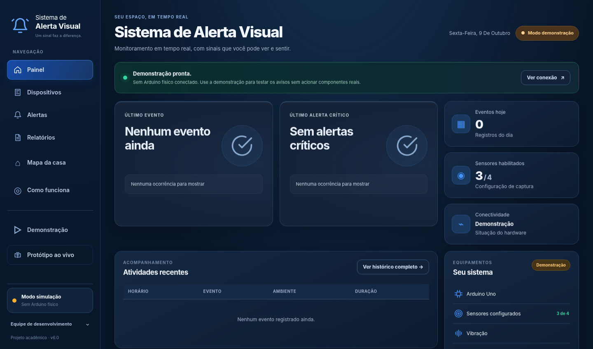
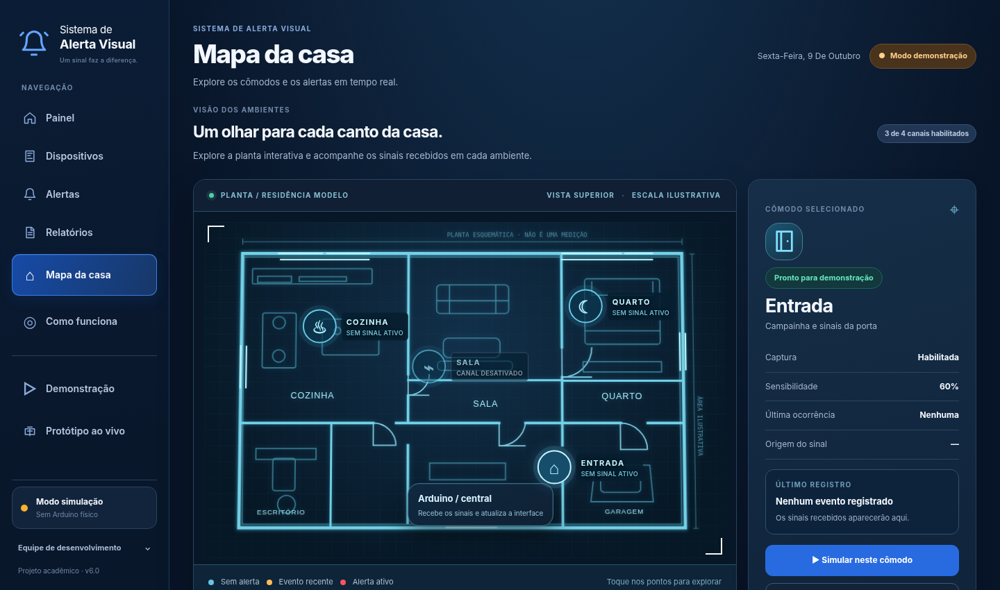
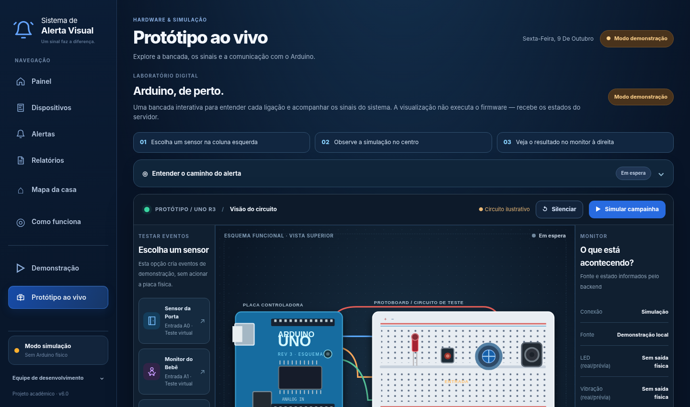
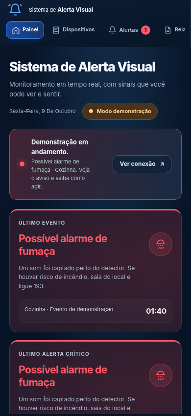
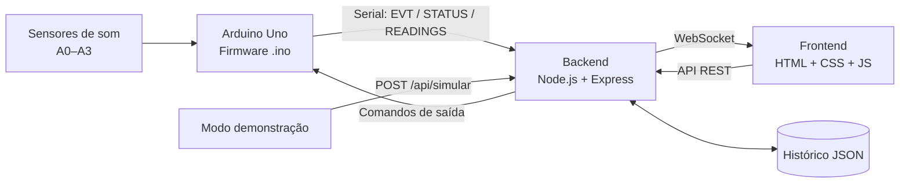

<<<<<<< HEAD
<div align="center">
=======
# Alerta Visual — aplicação integrada e apresentação acadêmica
>>>>>>> 1103737ffb805cc1d7adf90d9f08baa3668e53ea

# 🔔 a3_acessibilidade

### Alerta Visual — tecnologia para transformar sinais sonoros em informação visual e tátil

**Projeto acadêmico de acessibilidade · Versão 6.2**

<p>
  
  
  
  
</p>

**Uma interface que permite perceber sinais importantes da casa sem depender exclusivamente da audição.**

[Conhecer o projeto](#-sobre-o-projeto) · [Ver as telas](#-interface-da-aplicação) · [Executar](#-como-executar) · [Entender o Arduino](#-arduino-e-simulação) · [Equipe](#-desenvolvedores)

</div>

---

## ✨ Sobre o projeto

O **Alerta Visual** é um protótipo acadêmico pensado para explorar como recursos **visuais e táteis** podem apoiar a percepção de eventos sonoros em ambientes residenciais. A proposta combina uma aplicação web, um servidor Node.js e um Arduino Uno para demonstrar o caminho de um sinal: **entrada → processamento → aviso → registro**.

O projeto foi desenvolvido com foco em uma experiência simples de entender, mesmo para quem não tem familiaridade com eletrônica ou programação. Por isso, apresenta um **mapa interativo da casa**, uma **bancada virtual do Arduino** e um **modo de demonstração**, permitindo apresentar a ideia mesmo sem a placa física.

> [!IMPORTANT]
> **Este é um protótipo experimental, não um sistema de segurança certificado.** Os canais do Arduino usam sensores de amplitude sonora; eles **não identificam automaticamente** uma campainha, o choro de um bebê ou a presença de fumaça. O canal relacionado a fumaça representa a captação do **som de um detector de fumaça independente**, não a detecção direta de fumaça. A planta baixa e o circuito são ilustrações funcionais, não instalações validadas.

### 🎯 Objetivos

- Oferecer avisos com **texto, ícone e cor**, sem depender apenas de áudio.
- Demonstrar uma resposta com **luz e vibração** quando houver hardware adequadamente conectado.
- Visualizar **em qual ambiente/canal** o evento foi registrado.
- Manter um **histórico consultável** dos acontecimentos.
- Permitir uma **apresentação completa sem Arduino físico**, com simulações claramente identificadas.

## 🖥️ Interface da aplicação

<div align="center">
  
  <sub><b>Painel principal</b> — visão geral dos eventos, alertas e dispositivos.</sub>
</div>

<br />

<table>
  <tr>
    <td width="50%" align="center">
      
      <br /><b>Mapa da casa</b><br /><sub>Cômodos, canais e eventos destacados.</sub>
    </td>
    <td width="50%" align="center">
      
      <br /><b>Protótipo ao vivo</b><br /><sub>Bancada ilustrativa e monitoramento da comunicação.</sub>
    </td>
  </tr>
</table>

<details>
<summary><b>📱 Ver prévia do painel em uma tela menor</b></summary>

<br />
<div align="center">
  
</div>

</details>

### O que é possível fazer no sistema?

| Tela | O que oferece |
| :--- | :--- |
| **Painel** | Visão geral, eventos recentes, situação dos canais e do hardware. |
| **Dispositivos** | Ativar/desativar canais, ajustar sensibilidade e escolher cores dos avisos. |
| **Alertas** | Ver avisos com destaque visual, acompanhar informações e silenciar. |
| **Relatórios** | Consultar o histórico, filtrar por período/tipo, exportar CSV e limpar apenas testes simulados. |
| **Mapa da casa** | Explorar os cômodos, consultar o estado dos canais e simular eventos por ambiente. |
| **Como funciona** | Entender a arquitetura, as entradas, o processamento e a resposta do sistema. |
| **Demonstração** | Acompanhar um roteiro guiado com eventos identificados como simulação. |
| **Protótipo ao vivo** | Explorar a representação do Arduino, entradas, LED, vibração e monitor de mensagens. |

## 🧩 Arquitetura do sistema



**Fluxo resumido:**

1. Um canal de entrada recebe uma alteração de amplitude sonora — ou o usuário solicita uma **simulação**.
2. O **backend** recebe e valida o evento, atualiza o estado e registra o histórico.
3. O **WebSocket** permite atualizar o painel, o mapa e os alertas sem recarregar a página.
4. Em eventos originados do hardware, o servidor pode enviar comandos para **LED e motor vibratório**, conforme as configurações.
5. Na demonstração web, a interface mostra uma **prévia visual**: eventos simulados **não acionam nem interrompem** o hardware físico.

### 🛠️ Tecnologias utilizadas

| Camada | Tecnologias | Responsabilidade |
| :--- | :--- | :--- |
| **Interface** | HTML5, CSS3, JavaScript | Navegação, mapa SVG, controles, relatórios e acessibilidade básica. |
| **Servidor** | Node.js, Express | API, regras, configurações e armazenamento local. |
| **Tempo real** | WebSocket (`ws`) | Atualização dos eventos e estados na interface. |
| **Comunicação física** | `serialport` | Comunicação serial com a placa Arduino. |
| **Microcontrolador** | Arduino Uno / C++ | Leitura dos quatro canais e controle das saídas. |
| **Simulação externa** | Wokwi + ponte Python | Execução opcional de um firmware virtual. |

## 🚀 Como executar

### Pré-requisitos

- **Node.js 20+** e npm;
- navegador atualizado (Chrome, Edge ou Firefox);
- **Arduino IDE**, somente para gravar o firmware em uma placa real;
- **Python, pyserial, Arduino CLI e Wokwi**, somente para o modo Wokwi opcional.

### 1. Baixe o repositório

Pelo GitHub, use **Code → Download ZIP**, extraia os arquivos e abra um terminal na pasta principal do projeto.

### 2. Inicie o servidor

```bash
<<<<<<< HEAD
cd backend
=======
cd a3_acessibilidade/backend
>>>>>>> 1103737ffb805cc1d7adf90d9f08baa3668e53ea
npm install
npm start
```

### 3. Abra a aplicação

No navegador, acesse:

**http://localhost:3000**

> [!TIP]
> **Não tem Arduino?** Nenhum problema para apresentar o software. Sem `SERIAL_PORT` ou `SIM_TCP_PORT`, o sistema inicia em **modo demonstração**, sem alegar que uma placa real está conectada. Use a tela **Demonstração** ou o **Mapa da casa** para gerar sinais de teste.

## 🔌 Arduino e simulação

### Mapeamento lógico dos canais

| Canal | Ambiente representado | Entrada do Uno |
| :--- | :--- | :---: |
| Campainha | Entrada | `A0` |
| Bebê | Quarto | `A1` |
| Alarme de fumaça* | Cozinha | `A2` |
| Personalizável | Sala | `A3` |

\* O canal da cozinha representa **o apito de um detector independente**, não um sensor de fumaça certificado.

### Saídas previstas no firmware

| Recurso | Pino | Observação |
| :--- | :---: | :--- |
| LED RGB (R, G, B) | `D9`, `D10`, `D11` | Usar resistores e/ou drivers adequados. |
| Motor de vibração | `D5` | Exige transistor/driver e proteção; **não conectar diretamente ao pino**. |

**Para usar o Arduino físico:**

1. Grave `arduino/alerta_visual/alerta_visual.ino` na Arduino IDE.
2. Conecte a placa por USB e verifique qual porta serial foi atribuída.
3. Feche o Monitor Serial da IDE, para liberar a porta.
4. Na pasta `backend`, execute um dos comandos abaixo.

**Windows / PowerShell**

```powershell
$env:SERIAL_PORT="COM3"  # substitua pela porta correta
npm start
```

**Linux**

```bash
SERIAL_PORT=/dev/ttyACM0 npm start
```

A velocidade serial utilizada é **9600 baud**. Quando houver conexão, o sistema passa a apresentar os estados informados pelo firmware, o que **não substitui a confirmação elétrica dos componentes**.

<details>
<summary><b>🧪 Usar o Wokwi (opcional)</b></summary>

<br />

O projeto virtual está em [`wokwi/`](wokwi/), com configuração de comunicação RFC2217 e ponte TCP local.

**1.** Na raiz do repositório, compile o firmware de demonstração:

```bash
arduino-cli compile --fqbn arduino:avr:uno --output-dir wokwi/build wokwi/alerta_demo
```

**2.** Inicie o circuito pela extensão Wokwi no VS Code, usando `wokwi/wokwi.toml`.

**3.** Abra outro terminal e inicie o backend com a ponte habilitada:

```bash
cd backend
SIM_TCP_PORT=4001 npm start
```

No PowerShell, configure a variável com `$env:SIM_TCP_PORT="4001"` antes de `npm start`.

**4.** Na raiz do repositório, instale `pyserial` e execute a ponte:

```bash
python -m pip install pyserial
python wokwi/bridge.py
```

> O circuito Wokwi depende de ferramentas externas; a bancada desenhada no navegador **não compila nem emula eletronicamente** o firmware.

</details>

### ⚠️ Cuidados com o hardware

Uma fita LED de 12 V precisa de **fonte própria e driver adequado**. O motor vibratório também exige circuito de acionamento e proteção. A montagem precisa respeitar tensão, corrente e aterramento apropriados. Nunca use este protótipo como única forma de alerta para incêndio ou outras situações de risco.

## 🧪 Testes e validação

Foram criados testes para as regras do servidor e para o comportamento visual com respostas simuladas de API e WebSocket.

**Backend (sem placa física):**

```bash
node tests/backend-smoke.js
```

**Frontend (requer Python, Playwright e Chromium instalados):**

```bash
python tests/ui-playwright.py
python tests/ui-polimento.py
```

Os testes visuais cobrem navegação, estados de alerta, interações e diferentes tamanhos de tela. **Os testes do navegador usam uma API simulada em memória**; os testes do servidor são isolados. Portanto, **a execução HTTP completa, Wokwi em execução e o circuito Arduino físico ainda precisam ser validados no ambiente de apresentação**.

Consulte o relatório: [`TESTES_V6_2.md`](TESTES_V6_2.md).

## 📂 Estrutura do repositório

```text
a3_acessibilidade/
├── frontend/
│   ├── index.html            # Interface e telas
│   ├── css/                  # Estilos e responsividade
│   └── js/                   # API e comportamento das telas
├── backend/
│   ├── server.js             # REST, WebSocket e serial
│   ├── package.json          # Dependências e scripts
│   └── data/                 # Histórico/configurações gerados na execução
├── arduino/
│   └── alerta_visual/        # Firmware do Arduino Uno
├── wokwi/                    # Circuito virtual e ponte local
├── tests/                    # Testes automatizados e capturas
├── APRESENTACAO.md           # Roteiro para apresentação
├── TESTES_V6_2.md            # Registro de validação
└── README.md
```

## 🎤 Sugestão de roteiro para apresentação

1. **Problema:** por que avisos sonoros nem sempre são suficientes?
2. **Solução:** mostrar o painel e os recursos visuais/táteis previstos.
3. **Demonstração:** iniciar um evento pela entrada ou cozinha, deixando explícito que é simulado.
4. **Mapa:** mostrar o cômodo destacado e as informações do evento.
5. **Arduino:** explicar a bancada e a passagem entre sensor, firmware, servidor e interface.
6. **Histórico e limites:** conferir o registro e explicar o que ainda depende de validação física.

Há um roteiro mais completo em [`APRESENTACAO.md`](APRESENTACAO.md).

## 👥 Desenvolvedores

<div align="center">

**Projeto desenvolvido em grupo por:**

**Vinicius Iandoli · Lais Toyama · Vinicius Centurion · Cesar Melo**

<sub>Projeto acadêmico — a3_acessibilidade · Alerta Visual</sub>

</div>

---

<div align="center">
  <sub><strong>Alerta Visual</strong> · A tecnologia deve ampliar o acesso à informação.</sub>
</div>
